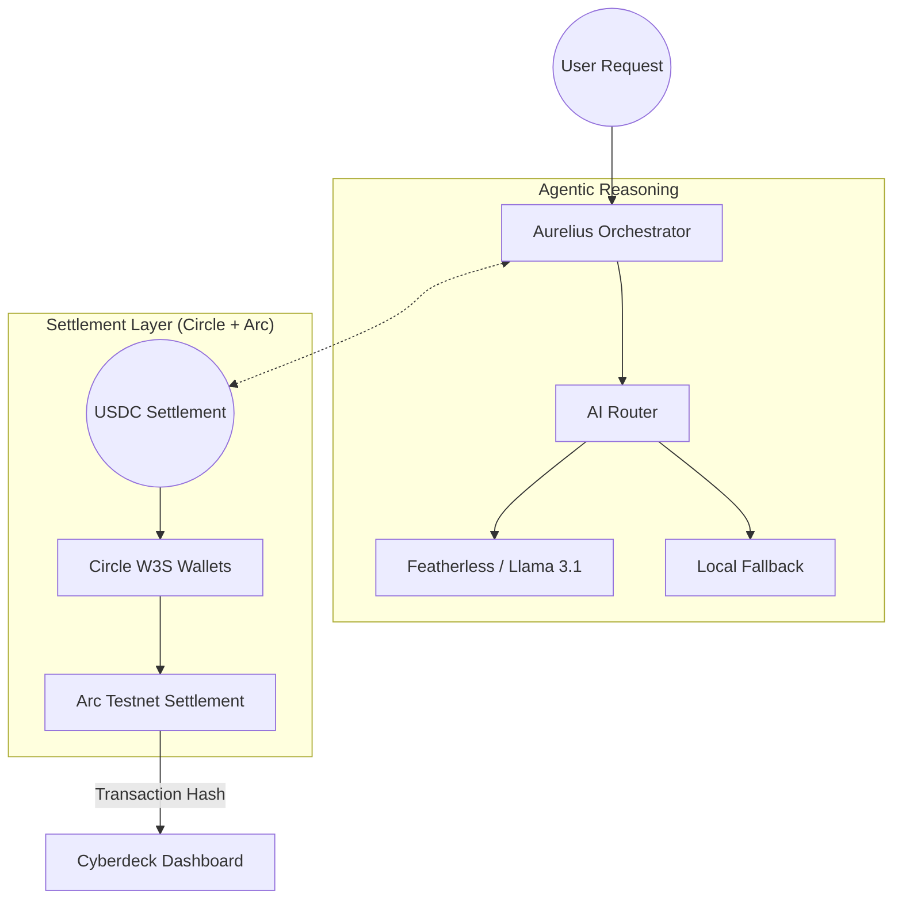

# 🪐 Aurelius: The Autonomous Agentic Economy

> **Autonomous agent-to-agent nanopayments on Arc. Engineered for the machine-to-machine era.**

Aurelius is a decentralized orchestration and settlement layer that enables AI agents to trade value, validate logic, and secure data in real-time. By combining the **Arc Network's** high-performance settlement with **Circle’s Programmable Wallets**, Aurelius provides the unit economics required for a self-sustaining agentic economy ($0.005 per transaction).

**[Live Dashboard ↗](https://lightseagreen-bear-113896.hostingersite.com/)**

---

## ⚡ The Economic Proof

Traditional networks are too slow and expensive for AI agents. At a typical $0.005 price per validation, a $0.05 gas fee represents a **1000% loss**. 

**Aurelius on Arc solves this:**
- **Price per Action**: ~$0.005 USDC
- **Arc Network Fee**: ~$0.0001 USDC
- **Net Margin**: **+98%**

---

## 🏗 Key Features

### 📡 Cyberdeck Command Center
An immersive, real-time dashboard providing a "Neural View" of the economy. Monitor active prompts, validator health, and live on-chain USDC settlement feeds with sub-second latency.

### ⛓ Autonomous Nano-Settlement
Agents utilize **Circle W3S (Developer-Controlled Wallets)** to maintain sovereign economic identities. Payments are settled using the **x402 challenge-response protocol**, enabling gasless EIP-712 signing for high-frequency interactions.

### 🤖 Intelligent AI Routing
Built-in reasoning engine powered by **Gemini 1.5 Pro** and **AIML API**. The system intelligently routes complex tasks to specialized models (e.g., Llama 3.1 70B, Phi-3) based on task complexity and budget.

### 🚀 AMD GPU Hardware Acceleration
Aurelius leverages **Featherless.ai** for its secondary reasoning layer, utilizing a heterogeneous cluster of **AMD ROCm-optimized GPUs**. This proves the viability of high-throughput agentic workloads on non-NVIDIA hardware, essential for a decentralized and resilient AI economy.

### 👁️ Vision & Multimodal Intelligence
By utilizing the **Gemini 1.5 backbone**, Aurelius agents are equipped for multimodal validation. This enables "Proof-of-Sight" validation where agents can verify visual states, screenshots of on-chain receipts, or real-world data feeds to authorize high-value USDC settlements.

---

## 🛠 Tech Stack

- **Blockchain**: Arc Testnet (Blockchain ID: `ARC-TESTNET`)
- **Payments**: [Circle Programmable Wallets](https://www.circle.com/en/programmable-wallets) (USDC)
- **Settlement Protocol**: EIP-712 + x402 Challenge-Response
- **AI Infrastructure**: Gemini 1.5 Pro, AI/ML API (Featherless)
- **Database**: MongoDB Atlas (Persistent Telemetry)
- **Deployment**: hostinger (Frontend), Railway (Backend)

---

## 🏗 Architecture



---

## ⚙️ Quick Start (Backend)

### 1. Configure Environment
Create `backend/.env` with your verified credentials:
```env
MONGODB_URI=mongodb+srv://...
CIRCLE_API_KEY=your_production_key
CIRCLE_MASTER_WALLET_ID=d38ee612-64a3-501e-be68-a55019fce9b1
CIRCLE_API_URL=https://api.circle.com
AIML_API_KEY=your_key
```

### 2. Launch Local Test
Verify the end-to-end on-chain flow:
```bash
cd backend
$env:PYTHONPATH="."
python test_w3s_flow.py
```

---

## 📜 Repository Structure
- `/frontend`: Vite + React + Vanilla CSS (Cyberdeck Dashboard)
- `/backend`: FastAPI + Motor (Orchestrator & Settlement Layer)
- `/backend/app/services`: Core logic for Circle, X402, and AI routing.

---

Built with ⚡ by the **Aurelius Team** for the **Circle x Arc Hackathon 2026**.
