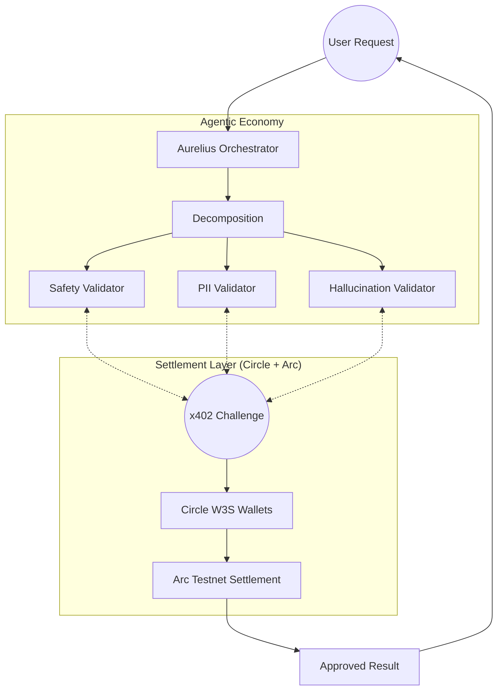

# Aurelius: The Autonomous Agentic Economy

Aurelius is a decentralized platform that enables a self-sustaining economy of AI agents. By integrating high-fidelity reasoning models with frictionless blockchain settlement, Aurelius allows autonomous agents to validate data, enforce guardrails, and settle nanopayments in real-time without human intervention.

Built for the **Circle x Arc Hackathon**, Aurelius leverages **Circle Developer-Controlled Wallets (W3S)** and the **Arc Testnet** to provide sub-second transaction finality and gasless agentic interactions.

---

## 🚀 Vision: Machine-to-Machine Nanopayments

In the coming agentic era, AI models will not just chat—they will carry out economic activity. Aurelius provides the "Guardrail & Settlement" layer for this new economy:
1. **Orchestration**: A central agent decomposes complex goals into tasks.
2. **Nano-Settlement**: Every task validation is protected by the **x402 protocol**, settling costs in USDC.
3. **Guardrails**: Specialized validator agents (Safety, PII, Hallucination) earn rewards for securing the output.

---

## 🛠 Tech Stack

### **Blockchain & Payments**
*   **Circle W3S (Developer-Controlled)**: Enables agents to hold identities and sign transactions autonomously via dynamic RSA-OAEP encryption.
*   **Arc Testnet**: A high-performance Layer-1 designed for financial services, used for sub-second, dollar-denominated settlements.
*   **x402 Protocol**: Facilitates gasless, EIP-712 based challenge-response settlements.

### **AI & Reasoning**
*   **Gemini 1.5 Pro**: Primary reasoning engine for agent coordination and task decomposition.
*   **Featherless AI (Llama 3.1 70B)**: High-performance fallback engine for secure, autonomous reasoning.
*   **Microsoft Phi-3 Mini**: Ultra-lightweight local fallback for high-availability logic.

### **Backend & Storage**
*   **FastAPI**: Asynchronous Python backend for real-time agent coordination.
*   **MongoDB**: Persistent storage for agent identities, task metadata, and transaction logs.

---

## 🏗 Architecture



---

## ⚙️ Setup & Configuration

### 1. Environment Variables
Create a `backend/.env` file with the following keys:
```env
# Circle Configuration
CIRCLE_API_KEY=your_circle_api_key
CIRCLE_ENTITY_SECRET=your_master_secret
CIRCLE_ENTITY_PUBLIC_KEY="PEM_FORMATTED_PUBLIC_KEY"
CIRCLE_MASTER_WALLET_ID=4cbefec9-5190-5042-ab9e-19ad207e82fe

# AI Configuration
FEATHERLESS_API_KEY=your_featherless_key
GOOGLE_API_KEY=your_gemini_key

# Database
MONGODB_URI=mongodb://localhost:27017
```

### 2. Implementation Details
The system uses a **Dynamic RSA-OAEP** encryption strategy for Circle Entity Secrets. Every API request generates a unique, non-reusable ciphertext to ensure maximum security for agent-controlled funds.

### 3. Funding
To initialize the economy:
1. Fund the **Master Wallet** on the Arc Testnet with test USDC.
2. Run the onboarding script to seed the individual validator wallets.

---

## 🧪 Testing the Economy

Aurelius includes a comprehensive "Economy Audit" script that verifies the full lifecycle from wallet creation to gasless on-chain settlement.

```bash
# From project root
python backend/test_w3s_flow.py
```

This script validates:
*   RSA-OAEP dynamic re-encryption.
*   W3S Wallet creation for agents.
*   EIP-712 gasless challenge-response signing.
*   Sub-second settlement polling on Arc.

---

## 📜 License
Copyright (c) 2026 Aurelius Team. Built for the Circle x Arc Hackathon.
