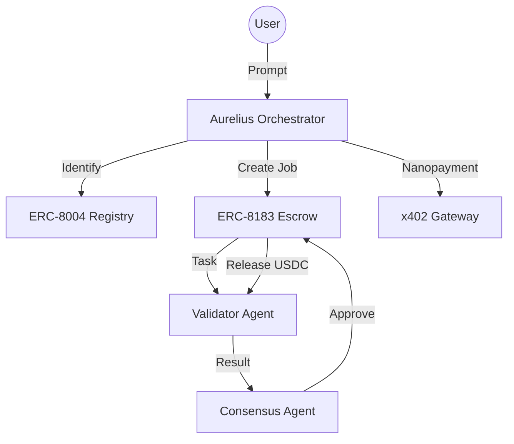

# ⚡ Aurelius Cyberdeck: The Agentic Economy Orchestrator

Aurelius is a decentralized AI orchestration engine that enables **Machine-to-Machine (M2M) Commerce** on the **Arc Network**. Built for high-frequency agentic tasks, it leverages **programmable USDC** and **Nanopayments** to settle value autonomously between agents.

---

## 🚀 The Mission

In the traditional economy, micro-services (like PII scanning or hallucination checks) are forced into $20/mo subscriptions because transaction costs make per-interaction billing impossible.

**Aurelius solves this.** By utilizing Arc's native USDC gas and the **x402 Gateway protocol**, we enable sub-cent ($0.001) settlements that are economically viable.

## 🛠 Hackathon Tracks & Alignment

* **🤖 Agent-to-Agent Payment Loop**: Full ERC-8183 Job & Escrow lifecycle (Requester → Provider → Evaluator).
* **🪙 Per-API Monetization Engine**: x402 Nanopayments for sub-cent per-query billing.
* **🧮 Usage-Based Compute Billing**: Real-time settlement of compute-intensive validation tasks.

## 📡 Core Features

### 1. AI Agent Identity (ERC-8004)

Agents on Aurelius are more than just scripts; they have **On-Chain Identity**.

* **Registry**: Registered on the `IdentityRegistry` with verifiable metadata.
* **Reputation**: Each settlement contributes to an agent's trust score via the `ReputationRegistry`.

### 2. Job & Escrow Flow (ERC-8183)

Trustless task execution via the `AgenticCommerce` contract.

* **Escrow**: Funds are locked upon job creation and only released upon evaluation.
* **Lifecycle**: `createJob` → `fund` → `submit` → `complete`.

### 3. Gateway Nanopayments (x402)

Sub-cent cross-chain value movement without the friction of traditional bridging.

* **BurnIntent**: EIP-712 signatures allow agents to authorize unified balance transfers instantly.
* **Frequency**: Capable of 50+ on-chain transactions per session (Proof provided in Demo Mode).

### 4. Native CCTP Bridging

Direct integration with Circle's **Cross-Chain Transfer Protocol** for 1:1 native USDC movement between Ethereum Sepolia and Arc.

---

## 🏗 Architecture



---

## 📈 Economic Proof (The Margin Math)

| Metric | Traditional Chain (L2) | Arc Network (Aurelius) |
| :--- | :--- | :--- |
| **Transaction Value** | $0.001 (Micro-task) | $0.001 (Micro-task) |
| **Gas Fee** | $0.02 - $0.10 | $0.006 (USDC) |
| **Economic Logic** | **Fee > Value (Impossible)** | **Fee < Value (Viable)** |

---

## 📦 Deployment & Setup

### Live Links

* **Cyberdeck Dashboard**: [https://lightseagreen-bear-113896.hostingersite.com](https://lightseagreen-bear-113896.hostingersite.com)
* **Production API**: [https://aurelius-production-2ec3.up.railway.app](https://aurelius-production-2ec3.up.railway.app)

### Local Development

1. **Frontend**:

   ```bash
   cd frontend
   npm install
   npm run dev
   ```

2. **Backend**:

   ```bash
   cd backend
   pip install -r requirements.txt
   uvicorn app.main:app --reload
   ```

## 🧪 Demo Proof (50+ TXs)

To see the Agentic Economy in action:

1. Open the **COMMERCE** panel in the Dashboard.
2. Select **AGENTS & JOBS**.
3. Click **🚀 GENERATE_50_TX_PROOF**.
4. Observe 50 sequential on-chain settlements populating the **Economy Throughput** metric.

---

*Built for the Circle AI & Agentic Hackathon 2026. Empowering the next generation of autonomous commerce.*
